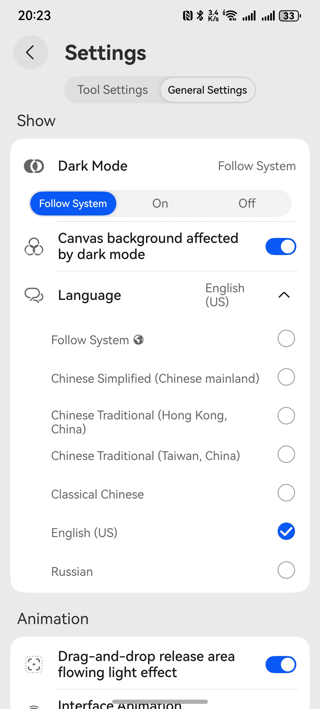

# HarmonyOS Application Preferred Language Switching Practice

In HarmonyOS application development, implementing multi-language support is a critical capability for enhancing user experience and expanding into international markets. Based on actual development cases, this article provides an in-depth analysis of the implementation mechanism for application preferred language switching.

## I. Technical Architecture Design

HarmonyOS provides a comprehensive internationalization solution through the `@ohos.i18n` system capability, which primarily consists of two core components:

1. **System Language Service**: Real-time access to device language environment
2. **Application Configuration Management**: Dynamic configuration of application-level language preferences

## II. System Language Detection Implementation

### 1. Device Language Environment Access
Retrieve the current device language environment using the `i18n.System.getSystemLanguage()` API:
```typescript
// Retrieve system-level language configuration
const systemLanguage = i18n.System.getSystemLanguage(); 
// Returns standard language codes such as 'zh-Hans', 'en-US'
```

### 2. Application Preferred Language Configuration
Implement dynamic configuration using `setAppPreferredLanguage()`:
```typescript
export const changeLanguage = (index: number) => {
  let lang: string = 'zh-Hans'
  switch (index) {
    case 0: {
      // Retrieve system language
      lang = i18n.System.getSystemLanguage() // systemLanguage is current system language
      break
    }
    case 1:
      //lang = 'zh-CN'
      break
    case 2:
      lang = 'zh-HK'
      break
    case 3:
      lang = 'zh-TW'
      break
    case 4:
      lang = 'nb'
      break
    case 5:
      lang = 'en-US'
      break
    case 6:
      lang = 'ru-RU'
      break
  }
  try {
    i18n.System.setAppPreferredLanguage(lang); // Set application preferred language
  } catch (error) {
  }
}
```
Key notes about this API:
- Supports standard BCP47 language tags
- Prioritizes matching language resources in the application's resource bundle
- Falls back to system language when no match is found
- Uses default language resources as final fallback

## III. UI Interaction Layer Implementation

Construct the language selection interface using ArkUI's declarative paradigm:
```typescript
  @Builder
  LangSetting(subItem: settingOptionModel) {
    List() {
      ForEach(subItem.selectOptions, (item: ResourceStr, index: number) => {
        ComposeListItem({
          contentItem: ({
            iconStyle: IconType.NORMAL_ICON,
            icon: '',
            //primaryText: 'Two-line list',
            secondaryText: item
          }),
          operateItem: ({
            radio: {
              isCheck: this.langIndex === index,
              onChange: (value) => {
                this.langIndex = index;
              }
            }
          })
        }).height(45)
      })
    }
  }
```
 