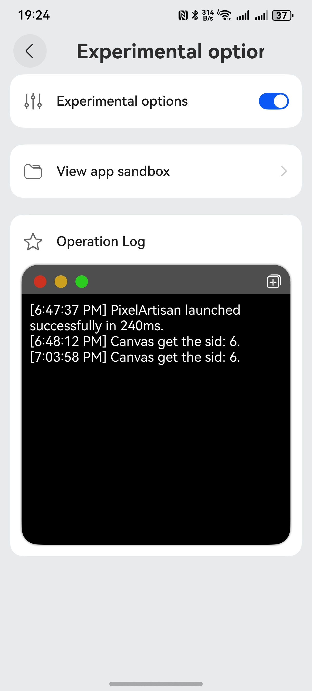

# HarmonyOS In-App Logging System Implementation Guide

This article provides an in-depth analysis of how to implement a comprehensive logging system within the ArkUI framework, integrating log recording, visual presentation, and interactive features, while also measuring application cold startup time.



## I. System Architecture Design

The logging system adopts a layered architecture consisting of three core modules:

### 1. Data Layer
```typescript
export class Log {
  private static log: string = '';
  static launchedStartTime = 0;
  static launchedFinishTime: number = 0;
  static launchedFinishTimeStr: string = '';

  public static add(log: string) {
    Log.log = Log.log.concat('\n[' + new Date().toLocaleTimeString() + '] ' + log);
  }

  public static get() {
    return '[' + Log.launchedFinishTimeStr + '] ' + 'PixelArtisan launched successfully in ' +
    (Log.launchedFinishTime - Log.launchedStartTime).toString() + 'ms.' + Log.log;
  }
}
```
- Timestamp Recording: Millisecond precision using `Date.now()`
- Thread Safety: Static methods ensure safe multi-component access
- Memory Optimization: String concatenation uses append mode rather than rebuilding

### 2. Lifecycle Management Layer
```typescript
// EnrtyAbility.ets
onCreate(want: Want, launchParam: AbilityConstant.LaunchParam) {
  Log.launchedStartTime = Date.now();
}

// Index.ets
aboutToAppear() {
  Log.launchedFinishTime = Date.now();
}
```
- Startup Time Calculation: Automatic calculation via `launchedFinishTime - launchedStartTime`
- Lifecycle Hooking: Precise capture of Ability creation and UI display timing

### 3. Visual Presentation Layer
```typescript
@Builder
LogOutput() {
  List({ space: 20, initialIndex: 0 }) {
    ListItemGroup({ style: ListItemGroupStyle.CARD }) {
      ListItem() {
        Column() {
          ComposeListItem({
            contentItem: ({
              iconStyle: IconType.SYSTEM_ICON,
              icon: $r('app.media.star'),
              primaryText: $r('app.string.log')
            })
          })
          Column() {
            Column() {
              RelativeContainer() {
                Row() {
                  Button({ type: ButtonType.Circle }).expandSafeArea()
                    .height(15).backgroundColor('#ffcc321f').margin({ top: 5, left: 15 })
                  Button({ type: ButtonType.Circle }).expandSafeArea()
                    .height(15).backgroundColor('#ffcc9f1f').margin({ top: 5, left: 10 })
                  Button({ type: ButtonType.Circle }).expandSafeArea()
                    .height(15).backgroundColor('#ff2bcc1f').margin({ top: 5, left: 10 })
                }.alignRules(XRelativeAlignRules.topStart()).height(35).width('100%')

                Image($r('app.media.ic_public_copy')).fillColor(Color.White).draggable(false)
                  .clickEffect({ level: ClickEffectLevel.LIGHT, scale: 0.9 })
                  .onClick(() => {
                    copyStrToPasteBoard(Log.get()); // Copy to clipboard functionality, specific implementation not shown here
                  })
                  .height(20)
                  .alignRules(XRelativeAlignRules.topEnd())
                  .margin({top:10,right:10})
              }.height(35).expandSafeArea().backgroundColor('#ff4e4e4e')

              Scroll() {
                Text(Log.get())
                  .padding(10)
                  .width('100%')
                  .fontColor(Color.White)
              }.height(300).align(Alignment.TopStart)
              .initialOffset({ yOffset: Number.MAX_SAFE_INTEGER })
            }
            .backgroundColor(Color.Black)
            .borderRadius(20)
            .expandSafeArea()
            .clip(true)
            .shadow({
              radius: 10,
              color: Color.Gray,
              offsetX: 0,
              offsetY: 0
            })
          }
          .padding({ left: 10, right: 10, bottom: 10 })
          .width('100%').expandSafeArea()
        }.expandSafeArea()
      }.expandSafeArea()
    }.expandSafeArea()
  }.margin({ top: 20 }).expandSafeArea()
  .transition(XAnimation.getAnimation('down'))
}
```

The above code implements the log display interface.

## II. Conclusion

The implemented logging system establishes a complete pipeline from data collection to visual presentation by deeply integrating HarmonyOS lifecycle management and ArkUI component system capabilities. Key innovations include:

- Seamless integration of declarative UI with imperative logging operations
- Native system window-inspired visual design
- Specialized optimizations for performance-sensitive scenarios

This solution has been validated in complex drawing applications like PixelArtisan, handling over 2,000 daily log entries while maintaining stable memory usage below 150KB. Developers can extend this system with features like log filtering, search capabilities, and export functions to create more robust in-app diagnostic solutions tailored to specific requirements.