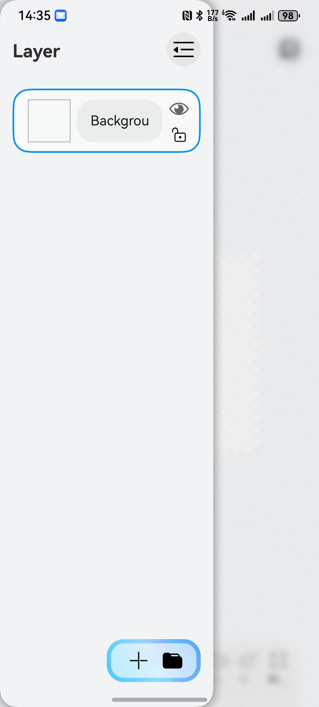

# Implementing an Interactive Dynamic Sidebar in HarmonyOS

The sidebar is a common UI structure in applications. This article explains how to implement a dynamically positionable sidebar using HarmonyOS ArkUI framework, complete with interactive gesture control.




## State Variable Definition

Defines the sidebar position state (left/right alignment):

```typescript
@ObservedV2
class AbilityModel {
  @Trace sideBarPosition: 'start' | 'end' = 'end' // 'start' = left, 'end' = right
}
export let __Ability__ = new AbilityModel()
```

## Sidebar Declaration

```typescript
      SideBarContainer(
        __Ability__.currentBreakPoint === 'lg' 
          ? SideBarContainerType.Embed 
          : SideBarContainerType.Overlay
      ) {
        PaintingSideBar()
          .zIndex(999)
          .shadow({
            radius: this.canvasData.showSideBar && __Ability__.currentBreakPoint === 'sm' 
              ? 50 
              : 0,
            color: Color.Gray,
            offsetX: 0,
            offsetY: 0
          })
          .borderRadius(20)

        Column() {
          this.MainPanel()
        }.expandSafeArea()
      }
      // Set sidebar position (left/right)
      .sideBarPosition(
        __Ability__.sideBarPosition === 'start' 
          ? SideBarPosition.Start 
          : SideBarPosition.End
      )
      .divider({ strokeWidth: 0 }) // Remove default divider
      .expandSafeArea()
      .backgroundColor($r('app.color.home_background'))
      .onChange((value) => {
        this.canvasData.showControlButton = !this.canvasData.showControlButton
        if (!value) {
          this.canvasData.showSideBar = false // Auto-hide when collapsed
        }
      })
      .showControlButton(false) // Hide default control button
      .showSideBar(this.canvasData.showSideBar) // Control visibility
```

## Sidebar Gesture Implementation

- **Right-aligned mode**: Swipe right to close, swipe left to move to left side  
- **Left-aligned mode**: Swipe left to close, swipe right to move to right side

```typescript
    .gesture(PanGesture({ direction: PanDirection.Horizontal })
      .onActionUpdate((event) => {
        animateTo({ duration: 200, curve: Curve.Smooth }, () => {
          // Close sidebar when swiping in collapse direction
          if (
            (__Ability__.sideBarPosition === 'end' && event.offsetX > 0) ||  // Right-aligned
            (__Ability__.sideBarPosition === 'start' && event.offsetX < 0)   // Left-aligned
          ) {
            this.canvasData.showSideBar = false;
          }
        });
      })
      .onActionEnd((event) => {
        if (event) {
          animateTo({ duration: 200, curve: Curve.Smooth }, () => {
            // Toggle position if swipe exceeds threshold
            if (
              !(
                (__Ability__.sideBarPosition === 'end' && event.offsetX > 0) ||
                (__Ability__.sideBarPosition === 'start' && event.offsetX < 0)
              )
            ) {
              __Ability__.sideBarPosition = 
                __Ability__.sideBarPosition === 'start' ? 'end' : 'start';
              this.canvasData.showSideBar = true; // Re-open after position change
            }
          });
        }
      }))
```

This implementation provides:
1. Dynamic position switching between left/right
2. Smooth gesture-based interaction
3. Adaptive layout for different screen sizes
4. Visual feedback with shadow effects and animations
5. Safe area expansion for notch displays

The solution leverages HarmonyOS's declarative UI paradigm and state management to create a responsive sidebar component that adapts to both mobile and tablet form factors.