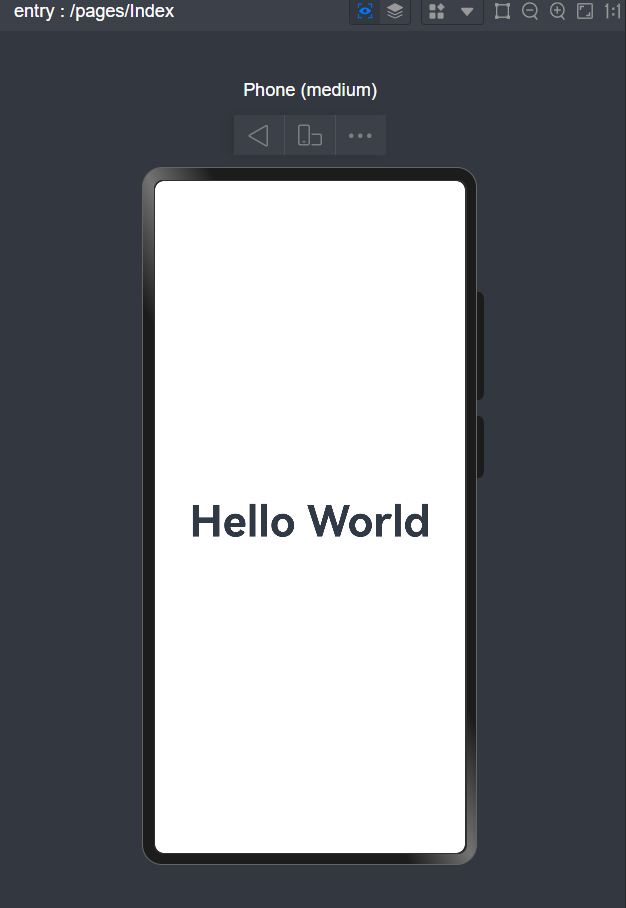
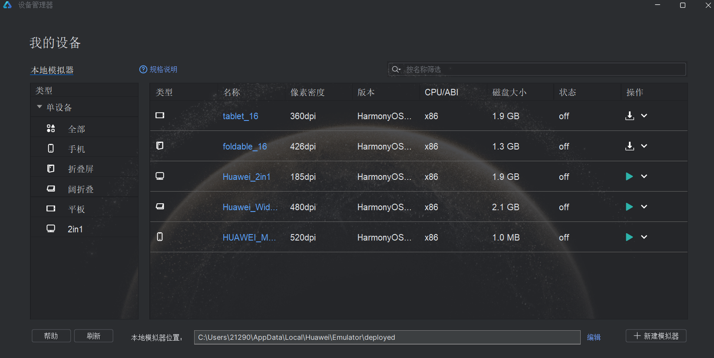
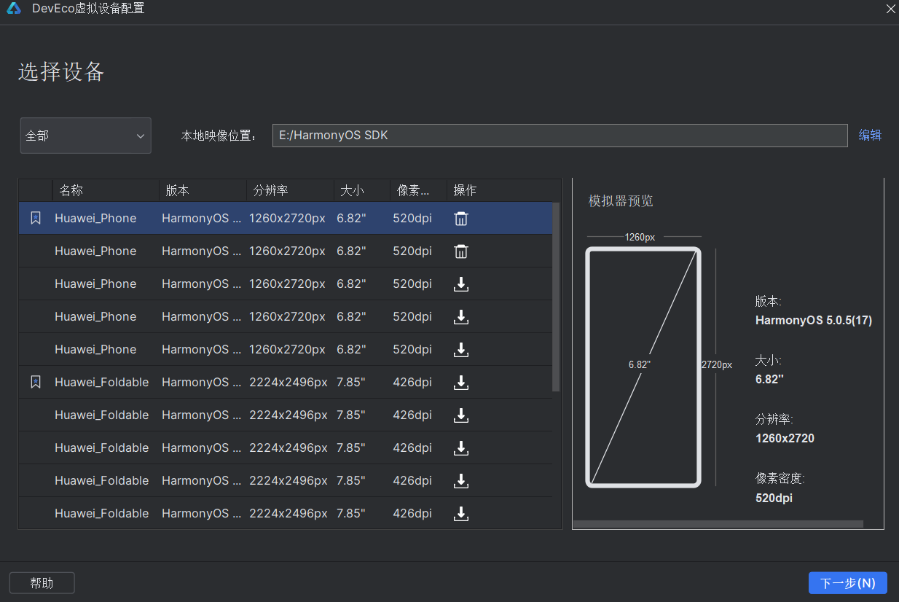
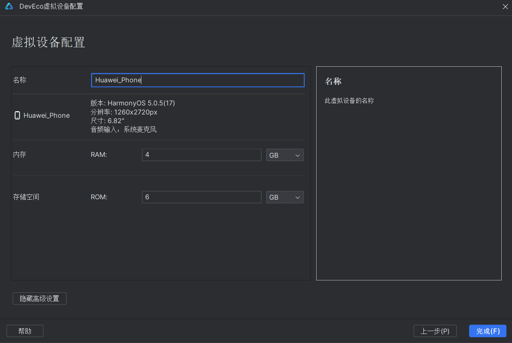
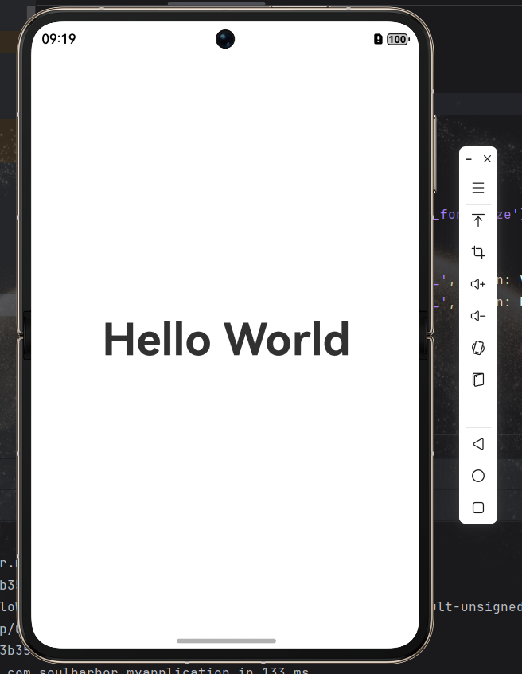

In HarmonyOS application development, the maturity of debugging toolchains directly impacts development efficiency and final user experience. DevEco Studio integrates Previewer, Emulator, and Real Device Debugging capabilities to form a complete debugging ecosystem spanning UI design to device adaptation. This article analyzes the core features and collaborative strategies of these three tools.

## I. Previewer: WYSIWYG UI Validation Tool

As a lightweight debugging tool, the Previewer enables real-time synchronization between code and UI through bidirectional binding. Developers can view page rendering results in a separate window by clicking the "Preview" button in DevEco Studio's workspace.

### Key Advantages:

#### Multi-Dimensional Preview Modes
- **Responsive Layout Verification**: Supports switching between phone/tablet/foldable devices with automatic screen size adaptation
- **Dynamic Effect Preview**: Real-time animation transitions for components marked with `@Preview` decorator

#### Bidirectional Modification
Right-click components in the preview interface to modify layout properties (e.g., padding/margin values), with changes automatically synchronized back to the codebase

#### Proactive Performance Monitoring
Built-in rendering performance panel displays real-time metrics (component tree construction time, layout calculation overhead) to identify potential performance bottlenecks during coding

## II. Emulator: Full-Scenario Device Simulation

HarmonyOS Emulator creates comprehensive virtual device environments through virtualization technology.

### Emulator Creation Workflow:
1. **Access Device Manager**: Click the device manager icon in DevEco Studio's toolbar
   
2. **Select Device Type**: Choose from phone/foldable/tablet/wide-fold/2in1 emulator templates
   
3. **Configure Parameters**: Set device name, RAM size, and storage capacity
   
4. **Complete Installation**: Start the emulator after successful creation

5. **Deploy Applications**: Select the running emulator from the device manager to test your project
   

Note: While emulators provide robust testing capabilities, certain hardware-specific features require real device validation. Refer to [Emulator Limitations](https://developer.huawei.com/consumer/cn/doc/harmonyos-guides/ide-emulator-specification) for details.

## III. Real Device Debugging: Ultimate Validation in Authentic Environment

Real device testing remains the gold standard for final validation.

### Wired Debugging
1. Enable **USB Debugging** in device settings: `System > Developer Options > USB Debugging`
2. Connect device to development machine via USB cable
3. Select the connected device from DevEco Studio's device manager to deploy applications

### Wireless Debugging
1. Enable **Wireless Debugging** in device settings: `System > Developer Options > Wireless Debugging`
2. Ensure both devices are on the same LAN
3. Register device IP/port in DevEco Studio: `Tools > IP Connection`
4. Select the wireless device from the device manager to start debugging

Note: View device IP/port information in `Developer Options > Wireless Debugging` settings.