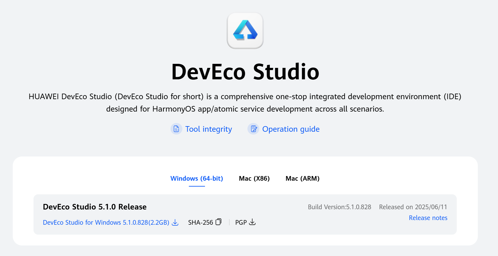
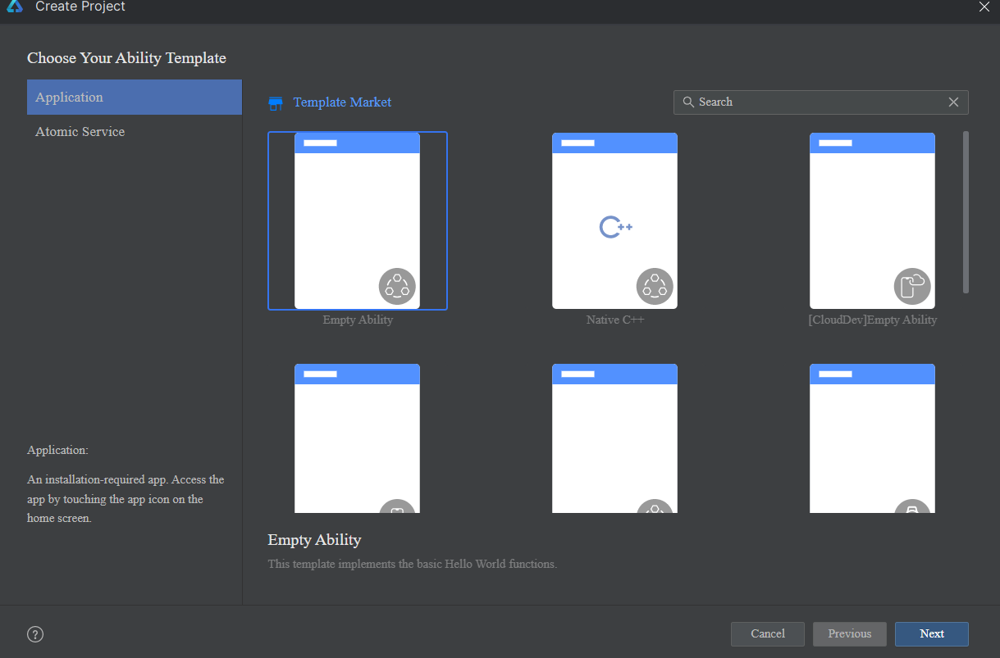
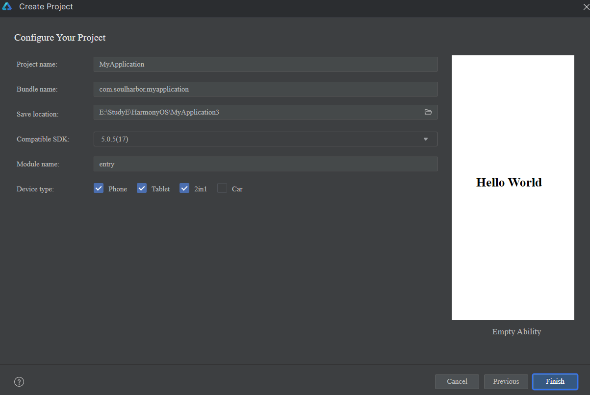

# Setting Up HarmonyOS Development Environment

## Install and Configure DevEco Studio IDE

DevEco Studio is the official Integrated Development Environment (IDE) for HarmonyOS application and Atomic Service development. It provides comprehensive features including code editing, compilation, debugging, performance optimization, security testing, and simulator integration to streamline your development workflow.

Download Links:

【ZH】https://developer.huawei.com/consumer/cn/download/

【EN】https://developer.huawei.com/consumer/en/download/deveco-studio



Select the appropriate version for your operating system (Windows/macOS) and prefer the latest stable release.

For detailed installation and SDK configuration steps, refer to:

【ZH】https://developer.huawei.com/consumer/cn/doc/harmonyos-guides/ide-software-install

【EN】https://developer.huawei.com/consumer/en/doc/harmonyos-guides/ide-software-install

# Create Hello World Project

After installation, create your first HarmonyOS project:


1. Select "New Project"
2. Choose "Empty Ability" template
3. Click "Next"

Configure your application details:



| Field         | Description                                                                 |
|---------------|-----------------------------------------------------------------------------|
| Project Name  | Name of your development project                                           |
| Bundle Name   | Unique application identifier (reverse-domain notation)                    |
| Save Location | File system path for project storage                                       |
| Compatible SDK| Minimum supported API version (recommend latest stable release)           |
| Module name   | Name of the application module                                             |
| Device type   | Target devices (phone/tablet/2-in-1/vehicle/wearable)                      |

Click "Finish" and wait for project initialization. Your Hello World project is now ready.

Sample Hello World page implementation:
```arkts
@Entry
@Component
struct Index {
  @State message: string = 'Hello World';

  build() {
    RelativeContainer() {
      Text(this.message)
        .id('HelloWorld')
        .fontSize($r('app.float.page_text_font_size'))
        .fontWeight(FontWeight.Bold)
        .alignRules({
          center: { anchor: '__container__', align: VerticalAlign.Center },
          middle: { anchor: '__container__', align: HorizontalAlign.Center }
        })
        .onClick(() => {
          this.message = 'Welcome';
        })
    }
    .height('100%')
    .width('100%')
  }
}
```

### Key components in this example:

* @Entry: Application entry point declaration
* @Component: UI component decorator
* @State: Reactive state management
* RelativeContainer: Adaptive layout container
* Text: UI text element with click interaction