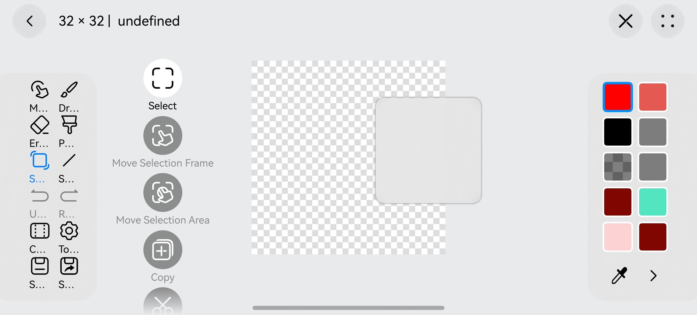

# Technical Analysis of Pseudo-Window Implementation in HarmonyOS Applications

Within HarmonyOS's ArkUI development framework, combining declarative UI paradigms with gesture interaction systems enables pseudo-window effects resembling native system windows. This approach maintains a single-window application architecture while providing multi-window-like interactive experiences, particularly suitable for canvas editing, map browsing, and other spatial operation scenarios. This article provides an in-depth technical analysis of pseudo-window implementation using code examples.



## I. Technical Architecture of Pseudo-Windows

The core implementation comprises three technical dimensions:

1. **Visual Container Construction**
```typescript
Column() {
  /* Window content */
}
.alignRules({
      top: { anchor: '__container__', align: VerticalAlign.Top },
      right: { anchor: '__container__', align: HorizontalAlign.End }
    })
.margin({ top: 60, right: 15 }) // Initial margins, adjustable as needed
```
Constructs initial visual positioning using a `Column` container holding core content components, combined with alignment rules and margin settings. This implements右上角 anchor positioning to simulate conventional system window placement.

2. **Gesture Interaction System**
```typescript
.gesture(PanGesture({ fingers: 1 })
  .onActionUpdate(/* Update logic */)
  .onActionEnd(/* State persistence */))
```
Leverages ArkUI's gesture system with single-finger pan gestures (PanGesture) to drive window position changes, implementing complete gesture event lifecycle management.

3. **State Management System**
```typescript
@Trace canvasViewingMarginTop: number = 60
@Trace canvasViewingMarginRight: number = 15
@Trace lastCanvasViewingMarginTop: number = 60
@Trace lastCanvasViewingMarginRight: number = 15
```
Employs reactive state management with `@Trace` decorator for automatic state change tracking and UI refresh.

## II. Core Interactive Implementation

### 1. Drag Dynamics Model
```typescript
this.canvasViewingMarginTop = 
  Math.min(Math.max(lastTop + event.offsetY, 60), maxTop);
this.canvasViewingMarginRight = 
  Math.min(Math.max(lastRight - event.offsetX, 15), maxRight);
```
Implements precision coordinate transformation algorithms:
- **Y-axis Handling**: Cumulative mode (lastTop + offsetY) with 60vp minimum to prevent overflow
- **X-axis Handling**: Reverse cumulative (lastRight - offsetX) maintaining visual drag consistency
- **Boundary Constraints**: Dynamic calculation using Math.min/max with page-dimension-dependent max values

### 2. Visual Anchor System
```typescript
// Maximum boundary calculation example
px2vp(pageSize.height) - 125  // 125vp reserved for safe content area
```
Establishes three-dimensional anchor constraints:
- **Physical Anchor**: Device pixel (px) based coordinates
- **Logical Anchor**: Density-independent coordinates via px2vp conversion
- **Safe Anchor**: 125vp reserved for system status/navigation bars

### 3. State Persistence
```typescript
.onActionEnd(() => {
  this.lastCanvasViewingMarginTop = currentTop;
  this.lastCanvasViewingMarginRight = currentRight;
})
```
Implements state solidification at gesture completion for:
- Interaction interruption recovery
- Animation tweening start point tracking
- Cross-page state preservation

## III. Adaptive Position Updates During Window Resizing

In complex mobile scenarios with device rotation, split-screen operations, or window resizing, pseudo-window systems require dynamic adaptation capabilities through these implementation techniques:

1. Size Monitoring Mechanism
```typescript
.onSizeChange(() => {
          const pageSize = componentUtils.getRectangleById('canvasPageRoot').size;
          if (this.isViewingAll) {
            this.canvasViewingMarginTop =
              Math.min(Math.max(this.canvasViewingMarginTop), px2vp(pageSize.height) - 125);
            this.canvasViewingMarginRight =
              Math.min(Math.max(this.canvasViewingMarginRight, 15), px2vp(pageSize.width) - 15 - 125);
          }
        })
```
Establishes continuous monitoring of root container size changes via ArkUI's `.onSizeChange` lifecycle method for dynamic boundary recalculation.

2. Dynamic Boundary Calculation Engine
Implements real-time spatial remapping and constraint validation with:
- Physical-to-logical coordinate conversion
- Safe area reservation (125vp for system UI)
- Dual-axis limit enforcement

3. Intelligent Layout Strategies
Provides differentiated adaptation for:
- **Full-view Mode**: Prioritizes complete canvas display with dynamic margin contraction
- **Edit Mode**: Maintains fixed workspace with proportional margin adjustment
- **Hybrid Mode**: Combines strategies for intelligent transitions

4. Performance Optimizations
- Debouncing through `requestAnimationFrame`
- Incremental calculation with cached previous dimensions
- GPU acceleration for critical transformations

5. Exception Handling
- Safe area detection for irregular displays
- Dimension anomaly detection for extreme aspect ratios
- Rendering context fallback mechanisms

## IV. Technical Evolution Directions

1. **Predictive Layout**: AI-based user intent prediction for pre-loading layouts
2. **Multi-Display Support**: Cross-device window handoff via DistributedData
3. **Foldable Optimization**: Dynamic hinge compensation for Mate X series

This adaptive system forms a complete闭环 with existing gesture interaction and state management, enabling pseudo-window technology to deliver:
- Environmental awareness across 200+ device form factors
- Seamless state migration between split-screen/floating modes
- Visual consistency through Dynamic Type system

By integrating these multi-dimensional adaptive designs, HarmonyOS pseudo-window technology provides professional applications with near-native multi-window experiences, maintaining single-application architecture advantages while overcoming traditional mobile workflow efficiency limitations.